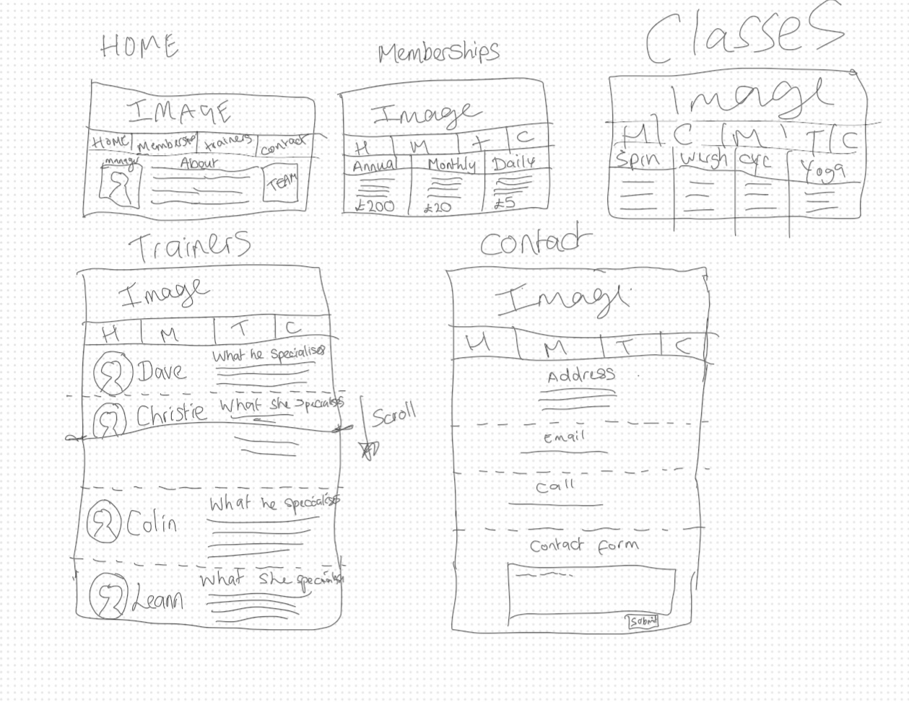
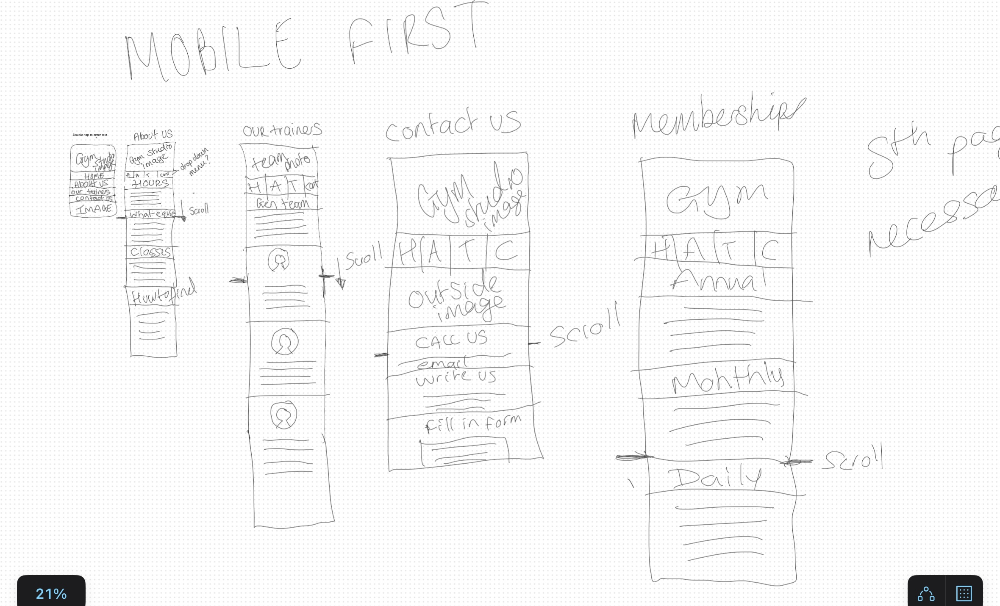
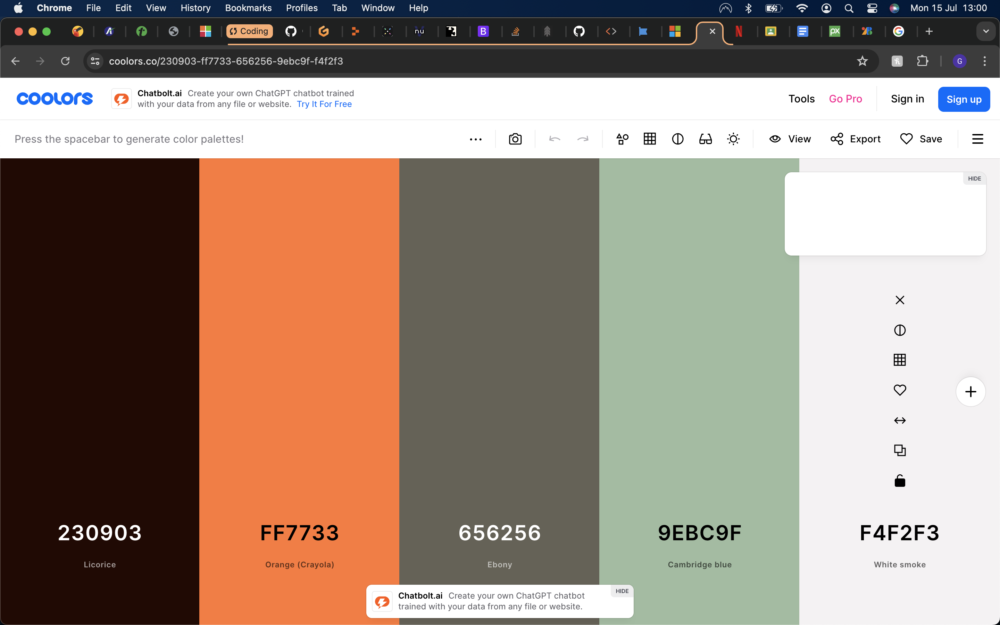

# [Work It - Click Here To View Deployed Site]('https://georgina90-x.github.io/Project-1')

- Work It is a website designed for the marketing purpose of a Work It Gym located in Manchester.
- Work It website provides information to users that inform them of the purpose and function of Work It Gyms.
- Work It will be of interest to those who wish to join a gym for the purpose of getting fit, getting social and even taking on new challenges.
- Work It has an easy to navigate menu that clearly details the information users will want to access.
- Work It showcases it's equipment that potential customers will want to know they have access to. 
- Work It has a simple and fresh design to make it understandable.

## Table of Contents

Click here for Table of Contents

[Mockup Screenshots](#mockup-screenshots)

[UX](#ux)

- [Colour Scheme](#colour-scheme)
- [Typography](#typography)

[User Stories](#user-stories)

- [New site Users](#new-site-users)
- [Returning Site Users](#returning-site-users)

[Features](#features)

- [Existing Features](#existing-features)
- [Future Features](#future-features)

[Testing](#testing)

[Deployment](#deployment)

[Credits](#credits)

[Content and Code](#content-and-code)

- [Acknowledgments](#acknowledgements)

## Mockup Of Designs / Wireframes

- I used a simple drawing application on iPad in order to visualise how I wanted the Work It website to look, with a simple structure.
- I liked the layout of the Love Running Project and used this as a skeleton for the project and then built upon that.

| Desktop Wireframe | Mobile Wireframe|
| :---: | :---: |
|  |  |

## User Experience

- The website is designed to clearly show where to access the information most in demand from visitors to gym websites.
- The website has a simple colour scheme that does not cause a sensory overload or detract users from accessing the information they want.
- There are a minimal number of navigation pages so users have a pleasant browsing experience.

## Colour Scheme

- The colour scheme is simple and uses colours that compliment each other.
- A primary colour was chosen as a 'brand' for Work It Gyms that will flow through the entire website.
- (https://coolors.co) was used to help create a suitable colour scheme for the website.
- I kept the colour scheme simple to two colours with a white background. The colours complimented eachother and did not distract from the websites purpose of providing clear information for the user.

- `#656256` used for primary text.
- `#ff7733` used for primary highlights.

Click for Coolors screenshot

 

## Typography

- I wanted a font that would be clear for users to read with no difficulty and for it to have a distinct identity for the Work It brand.
- I used Google Fonts to choose a font that was modern and fresh and settled on Manrope.
- The generic sans-serif was used as a backup font for users who did not have the google font.
- For logos, that replaced writing for a more visual aspect, I used Font Awesome. 

[Manrope](https://fonts.google.com/specimen/Manrope?preview.text=Work%20It%20Gyms) was used for all text within the website.

[Font Awesome](https://fontawesome.com) was used to provide the icons for the home page and contact page.

### New Site Users

- As a new site user, I would like to know the purpose of the website.
- As a new site user, I would like to see where my local Work It gym is and its operational hours are.
- As a new site user, I would like to see what equipment my local Work It gym has.
- As a new site user, I would like to see what Personal Trainers are available and what they have to offer.
- As a new site user, I would like to see what the cost of subscriptions are.

### Returning Site Users

- As a returning site user, I would like to know the contact details.
- As a returning site user, I would like to be see if the subscription prices are the same.
- As a returning site user, I would like to see if opening hours are impacted by 'holidays'.

### Existing Features

- The website is designed in a way for minimal navigation for users to simply click on a navbar and access the information they want.
- | Home | Home can be navigated via the Home button on the navbar as well as the banner image, as per typical user expectancy.
- | Personal Trainers | A page that shows the available personal trainers, their credentials and how they can help.
- | Subscriptions | A page that provides the relevant information in regards to subscribing to use the gym.
- | Contact | A page that provides clear details how users can contact the company.
- | Footer | The footer contains icons to socials for the user to easily contact/ see the content of the gyms socials. 

### Future Features
| Contact Form | for users to directly contact the gym should they not want to use the other methods.
| Class Signup | a way for users to signup to classes they are interested in.
| Subscription Signup | a way for users to join the gym through the website.

## Tools & Technologies Used

- [HTML](https://en.wikipedia.org/wiki/HTML) used for the main site content.
- [CSS](https://en.wikipedia.org/wiki/CSS) used for the main site design and layout.
- [Bootstrap](https://www.bootstrap.com) used for preset template designs.
- [Gitpod](https://gitpod.io) used for version control and to 'push' to Github.
- [GitHub](https://github.com) used to store the website and its versions.
- [GitHub Pages](https://pages.github.com) used for hosting the deployed front-end site for anyone to access.
- [VSCode](https://code.visualstudio.com/) used for local IDE for development.
- [Google Fonts](https://fonts.google.com/) used to search a suitable font and obtain a download link for that font.
- [Font Awesome](https://fontawesome.com/) used to add GitHub icon to the footer and modal and search icon to the search button.

## Deployment

The site was deployed to GitHub Pages. The steps to deploy are as follows:

- In the [GitHub repository](https://github.com/Georgina90-x/Project-1.git)
- Click the settings tab above.
- Under 'code and automation' menu at the side click 'pages'.
- Click 'select branch' under the Build and Deployment section.
- Select '*main' as the branch and click 'save'.

To access the live link, follow this link: (https://georgina90-x.github.io/Project-1/).

## Testing

The following were used as part of the testing of the website which tested the HTML and CSS of the website to make sure it followed the standard.

## Content and Code

The following sites were used to help aid the creation of the website.

- [Github](https://www.github.com)
- [Gitpod](https://www.gitpod.io)
- [Coolors](https://www.coolors.co)
- [Font Awesome](https://www.fontawesome.com)
- [Google Fonts](https://www.fonts.google.com)
- [Unsplash](https://www.unsplash.com)

## Credits

The following are direct links to any external sources used in the creation of the website.

- [Dave Bradford Image](https://unsplash.com/photos/man-wearing-white-v-neck-shirt-iFgRcqHznqg) by Joseph Gonzalez
- [Scott Lacey Image](https://unsplash.com/photos/mans-grey-and-black-shirt-ILip77SbmOE) by Albert Dera
- [Jenny Cleary Image](https://unsplash.com/photos/closeup-photography-of-woman-smiling-mEZ3PoFGs_k) by Michael Dam
- [Louise Bassford Image](https://unsplash.com/photos/woman-in-blue-shirt-and-black-leather-boots-wV24lC56dVI) by Kade Beasley
- [Gym Area Image](https://prod-everyoneactive-wp.s3.eu-west-2.amazonaws.com/wp-content/uploads/2017/09/27164607/Free-Weights-Area.jpg) 
- [Circle Image](https://cdn.emilyskyefit.com/esf/content/17000/16772/images/landscapewidemobile1x-emilybutt-16-9.jpg) 
- [Google Map Instructions](https://blog.hubspot.com/website/how-to-embed-google-map-in-html#:~:text=In%20the%20CSS%2C%20the%20padding,percentage%20value%20of%20padding%2Dbottom) 
- [README Template](https://github.com/boderg/your-weather/blob/main/README.md) by borderg

## Acknowledgements

